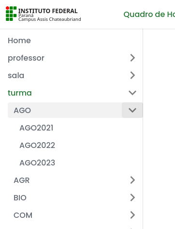

# Home

  Seja bem-vindo ao novo sistema web para o quadro de horários do Instituto Federal do Paraná - Campus Assis Chateaubriand. 

## Histórico

| Versão    |   Início   |     Fim    |
|-----------|:----------:|:----------:|
| [2024.1.v1](/docs/2024.1.1/intro) | 15/02/2024 | 17/02/2024 |
| [2024.1.v2](/docs/2024.1.2/intro) | 18/02/2024 | 24/02/2024 |
| [2024.1.v3](/docs/2024.1.3/intro) | 25/02/2024 | 09/03/2024 |
| [2024.1.v4](/docs/2024.1.4/intro) | 10/03/2024 | 17/03/2024 |
| [2024.1.v5](/docs/2024.1.5/intro) | 18/03/2024 | 23/03/2024 |
| [2024.1.v6](/docs/2024.1.6/intro) | 24/03/2024 | 29/06/2024 |
| [2024.1.v7](/docs/2024.1.7/intro) | 30/06/2024 | 06/07/2024 |
| [2024.1.v8](/docs/2024.1.8/intro) | 07/07/2024 | 14/07/2024 |
| [2024.1.v9](/docs/2024.1.9/intro) | 15/07/2024 | 20/07/2024 |
| [2024.1.v10](/docs/2024.1.10/intro) | 21/07/2024 | 27/07/2024 |
| [2024.1.v11](/docs/2024.1.11/intro) | 28/07/2024 | 24/08/2024 |
| 2024.2.v1 | 25/08/2024 | Atual |

## Novidades

17/02/2024: Tabela de versões e mudanças.

23/jul/2023: Organização da Turma por Cursos e das Salas por Prédios

12/fev/2023: Ferramenta de busca

01/fev/2023: Versão "Em desenvolvimento" para planejamento de trocas e proxímas atualizações

## Novas funcionalidades

- Menu lateral para melhorar sua navegação.
- Fácil acesso ao horário de qualquer professor, turma, ou sala de aula.
- Tema claro e escuro.
- Configure o seu próprio horário escolhendo a forma como quer seja exibido.
  - Completo (Padrão): Será exibido o horário das aulas de todos os dias das 07:30 até as 22:40.
  - Condensado: Será exibido o horário entre a primeira e última aula, sem tirar os espaços vago.
  - Super condensado: Será exibido o horário entre a primeira e última aula, tirando os dias que não possui aula e os espaços vago.
- A cada alteração no horário será criado uma nova versão e armazenada. Sendo assim, você consegue visualizar até os horários antigo.
- Foto do horário por completo (Disponível apenas para dispositivos Android e Desktop).
